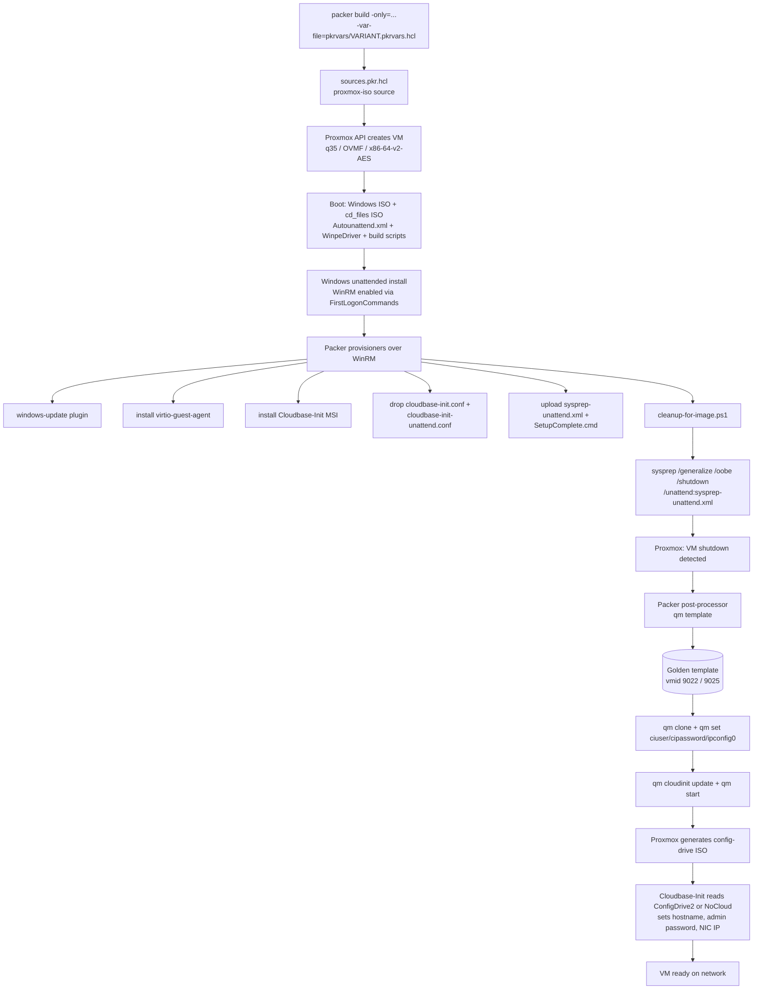

# Plan: Packer templates for Windows Server 2022/2025 Desktop on Proxmox 9

## Context

The repo currently contains only `RESEARCH.md` — a survey of how to build cloud-init-ready Windows images on Proxmox 9 with Packer + Cloudbase-Init. We need to turn that research into a working Packer project that produces two golden templates: **Windows Server 2022 Desktop** and **Windows Server 2025 Desktop**, both cloneable via `qm set --ipconfig0/--ciuser/--cipassword` with Cloudbase-Init applying on first boot.

Design priorities driven by the research:

- `machine=q35`, `cpu=x86-64-v2-AES`, `bios=ovmf` — Proxmox 9 + Windows won't see the cloud-init CDROM otherwise.
- Cloudbase-Init config with **both** `ConfigDriveService` and `NoCloudConfigDriveService` in `metadata_services` plus `inject_user_password=true`.
- Sysprep-generalize at the end of the Packer build so clones get a fresh SID + OOBE pass.
- Shared `common/`-style layout (one Packer project, per-variant pkrvars + Autounattend) rather than four duplicated trees.

## Repository layout

```
.
├── README.md
├── PLAN-2026-04-18-packer-windows-proxmox-templates.md  # copy of this plan, saved before implementation
├── .gitignore
├── pixi.toml                     # pins packer + tasks; no system installs
├── build.sh                      # thin wrapper: ./build.sh 2025-desktop
├── packer.pkr.hcl                # required_plugins + locals
├── variables.pkr.hcl             # input variables
├── sources.pkr.hcl               # source "proxmox-iso" per variant
├── build.pkr.hcl                 # single build block, both sources, shared provisioners
├── pkrvars/
│   ├── 2022-desktop.pkrvars.hcl.example
│   └── 2025-desktop.pkrvars.hcl.example
├── autounattend/
│   ├── 2022-desktop/Autounattend.xml
│   └── 2025-desktop/Autounattend.xml
├── winpe-drivers/
│   └── README.md                 # how to populate $WinpeDriver$ from virtio-win ISO
├── scripts/
│   ├── pre-build/
│   │   ├── enable-winrm.ps1
│   │   └── install-virtio-guest-agent.ps1
│   └── post-build/
│       ├── install-cloudbase-init.ps1
│       ├── cleanup-for-image.ps1
│       └── SetupComplete.cmd
├── configs/
│   ├── cloudbase-init.conf
│   ├── cloudbase-init-unattend.conf
│   └── sysprep-unattend.xml
└── docs/
    └── clone-examples.md         # qm clone + qm set recipes
```

## Tooling: pixi

All build-host tooling (Packer CLI + any helper binaries) is provisioned via **pixi**, which is already available in the execution environment. No global `apt`/`brew`/manual installs.

### `pixi.toml`
```toml
[project]
name        = "proxmox-windows-packer"
version     = "0.1.0"
description = "Packer templates for Windows Server 2022/2025 Desktop on Proxmox 9"
channels    = ["conda-forge"]
platforms   = ["linux-64", "osx-arm64", "osx-64"]

[dependencies]
packer = ">=1.11"    # conda-forge ships HashiCorp Packer
jq     = "*"         # used by build.sh for pkrvars sanity checks
bash   = "*"

[tasks]
init       = "packer init ."
fmt        = "packer fmt -recursive ."
validate   = { cmd = "packer validate -var-file=pkrvars/${VARIANT}.pkrvars.hcl .", env = { VARIANT = "2025-desktop" } }
build-2025 = "./build.sh 2025-desktop"
build-2022 = "./build.sh 2022-desktop"
```

Developer workflow is `pixi install` → `pixi run init` → `pixi run build-2025`. `build.sh` itself calls `pixi run packer ...` internally so it works whether invoked directly or through `pixi run`.

### `build.sh`
Single-file bash wrapper so operators don't need to remember `-only=` / `-var-file=` incantations.

```bash
#!/usr/bin/env bash
# Usage: ./build.sh <variant>   where variant is 2022-desktop | 2025-desktop
set -euo pipefail

VARIANT="${1:-}"
case "$VARIANT" in
  2022-desktop) SOURCE="proxmox-iso.win2022_desktop" ;;
  2025-desktop) SOURCE="proxmox-iso.win2025_desktop" ;;
  *) echo "usage: $0 {2022-desktop|2025-desktop}" >&2; exit 2 ;;
esac

PKRVARS="pkrvars/${VARIANT}.pkrvars.hcl"
[[ -f "$PKRVARS" ]] || { echo "missing $PKRVARS — copy from ${PKRVARS}.example" >&2; exit 2; }

: "${PKR_VAR_proxmox_api_token:?export PKR_VAR_proxmox_api_token before running}"

PACKER="pixi run --manifest-path \"$(dirname "$0")/pixi.toml\" packer"
eval "$PACKER init ."
eval "$PACKER validate -var-file=\"$PKRVARS\" ."
eval "$PACKER build -only=\"$SOURCE\" -var-file=\"$PKRVARS\" ."
```

Script is `chmod +x`. Exit codes bubble up from packer. No retry logic — Packer's own timeouts cover transient Proxmox API blips.

## Build flow



## File-by-file specification

### `packer.pkr.hcl`
- `packer { required_plugins { proxmox = ">= 1.2.2", windows-update = ">= 0.14.0" } }`
- `locals` for:
  - `build_password = "P@ssw0rd!"` (throwaway, reset at sysprep)
  - `winrm_username = "Administrator"`
  - Template vmids: `2022 = 9022`, `2025 = 9025`.

### `variables.pkr.hcl`
Input variables (no defaults for secrets):
- `proxmox_url`, `proxmox_username`, `proxmox_api_token` (sensitive)
- `proxmox_node`, `proxmox_storage_pool`, `proxmox_iso_storage_pool`
- `vm_boot_iso` (e.g. `local:iso/SERVER_EVAL_x64FRE_en-us.iso`)
- `vm_virtio_iso` (e.g. `local:iso/virtio-win.iso`)
- `vm_os_version` (`2022` | `2025`)
- `vm_os_edition` (defaults `SERVERDATACENTER`)
- `vm_name`, `vm_template_vmid`
- `vm_disk_size` default `80G`
- `vm_cpu_cores`, `vm_memory` with sane defaults (2 / 4096)

### `sources.pkr.hcl`
Two `source "proxmox-iso"` blocks — `win2022_desktop`, `win2025_desktop` — identical except for the variant-specific values read from locals/vars. Key fields from RESEARCH.md §Packer layout:

```hcl
machine              = "q35"
bios                 = "ovmf"
cpu_type             = "x86-64-v2-AES"
scsi_controller      = "virtio-scsi-single"
efi_config { efi_storage_pool = var.proxmox_storage_pool, pre_enrolled_keys = false }
network_adapters { model = "virtio", bridge = "vmbr0" }
disks { type = "virtio", disk_size = var.vm_disk_size, storage_pool = var.proxmox_storage_pool, format = "raw" }
iso_file = var.vm_boot_iso
additional_iso_files {
  cd_files = [
    "./autounattend/${var.vm_os_version}-desktop/Autounattend.xml",
    "./winpe-drivers/*",
    "./scripts/pre-build/*",
  ]
  iso_storage_pool = var.proxmox_iso_storage_pool
  unmount = true
}
additional_iso_files { device = "ide3", iso_file = var.vm_virtio_iso, unmount = true }
communicator      = "winrm"
winrm_username    = local.winrm_username
winrm_password    = local.build_password
winrm_use_ssl     = true
winrm_insecure    = true
winrm_timeout     = "6h"
template_name        = var.vm_name
template_description = "Built by Packer — ${var.vm_os_version} ${var.vm_os_edition}"
vm_id                = var.vm_template_vmid
```

### `build.pkr.hcl`
Single `build` block listing both sources. Provisioners in the order RESEARCH.md §Provisioners prescribes:

1. `powershell { inline = ["bcdedit /timeout 5"] }`
2. `windows-update { search_criteria = "IsInstalled=0", filters = ["exclude:$_.Title -like '*Preview*'", "exclude:$_.InstallationBehavior.CanRequestUserInput -eq $true", "include:$true"], update_limit = 50 }`
3. `file { source = "./configs/sysprep-unattend.xml", destination = "C:\\Windows\\Panther\\Unattend\\unattend.xml" }`
4. `file { source = "./scripts/post-build/SetupComplete.cmd", destination = "C:\\Windows\\Setup\\Scripts\\SetupComplete.cmd" }`
5. `powershell { script = "./scripts/post-build/install-cloudbase-init.ps1" }`
6. Two `file` uploads for `cloudbase-init.conf` + `cloudbase-init-unattend.conf` into `C:\Program Files\Cloudbase Solutions\Cloudbase-Init\conf\`.
7. `powershell { script = "./scripts/post-build/cleanup-for-image.ps1" }`
8. `windows-shell { inline = ["C:\\Windows\\System32\\Sysprep\\sysprep.exe /generalize /oobe /shutdown /unattend:C:\\Windows\\Panther\\Unattend\\unattend.xml"] }`

### `autounattend/{2022,2025}-desktop/Autounattend.xml`
Per RESEARCH.md §Autounattend:
- GPT disk layout (EFI 260MB + MSR 128MB + OS rest)
- `<DriverPaths>` pointing at `E:\` (cd_files ISO) for `$WinpeDriver$\*`
- `<ImageInstall>` with wildcard MetaData on `/IMAGE/NAME`:
  - 2022: `Windows Server 2022 SERVERDATACENTER` (Desktop Experience edition name)
  - 2025: `Windows Server 2025 SERVERDATACENTER`
- `<AutoLogon>` with `Administrator` + `P@ssw0rd!`, 3 logon count
- `<FirstLogonCommands>`:
  1. `powershell -ExecutionPolicy Bypass -File E:\enable-winrm.ps1`
  2. `powershell -ExecutionPolicy Bypass -File E:\install-virtio-guest-agent.ps1` (uses mounted virtio ISO on `D:` or `F:`)
- `<TimeZone>UTC</TimeZone>`, `<InputLocale>en-US</InputLocale>`.

### `scripts/pre-build/enable-winrm.ps1`
Create self-signed HTTPS listener, open firewall 5986, set `Set-Item WSMan:\localhost\Service\Auth\Basic $true`, `AllowUnencrypted=false`, `Set-Item WSMan:\localhost\Service\AllowUnencrypted $false`, start `WinRM`. Reference mfgjwaterman `WinRM.ps1`.

### `scripts/pre-build/install-virtio-guest-agent.ps1`
Detect the virtio drive letter (search for `virtio-win-guest-tools.exe`), run silent install (`/S`), wait for service.

### `scripts/post-build/install-cloudbase-init.ps1`
- Download MSI if not pre-bundled: `https://cloudbase.it/downloads/CloudbaseInitSetup_Stable_x64.msi`
- `msiexec /i CloudbaseInitSetup.msi /qn LOGGINGSERIALPORTNAME="" INSTALLDIR="C:\Program Files\Cloudbase Solutions\Cloudbase-Init\"`
- Do **not** pass `RUN_SERVICE_AS_LOCAL_SYSTEM=1` because we reset the service user; leave defaults.
- Exit 0 only after MSI exit code 0.

### `scripts/post-build/cleanup-for-image.ps1`
- `Optimize-Volume -DriveLetter C -Defrag -Verbose` (skip on SSDs)
- Clear event logs, defender defs, temp dirs (`C:\Windows\Temp`, `C:\Users\*\AppData\Local\Temp`)
- `cipher /w:C:` optional (skip by default — slow)
- Disable WinRM HTTPS listener so sysprep doesn't bake a stale cert: `winrm delete winrm/config/Listener?Address=*+Transport=HTTPS`
- `Stop-Service -Name cloudbase-init` and `Set-Service -Name cloudbase-init -StartupType Manual` (sysprep unattend will flip to Automatic)

### `scripts/post-build/SetupComplete.cmd`
Single line: enable Cloudbase-Init service on first boot after sysprep completes —
```
sc.exe config cloudbase-init start= auto
sc.exe start cloudbase-init
```

### `configs/cloudbase-init.conf` + `cloudbase-init-unattend.conf`
Verbatim from RESEARCH.md §Cloudbase-Init config — dual `metadata_services`, `inject_user_password=true`, `first_logon_behaviour=no`, `rename_admin_user=false`, all plugins listed. `-unattend.conf` uses the same body but only runs during the sysprep-specialize pass (smaller plugin list typically — keep identical for simplicity unless a plugin misbehaves).

### `configs/sysprep-unattend.xml`
- `generalize` pass: `<SkipRearm>1</SkipRearm>`
- `oobeSystem` pass: `<OOBE><HideEULAPage>true</HideEULAPage><ProtectYourPC>3</ProtectYourPC></OOBE>`, `<TimeZone>UTC</TimeZone>`, `<RegisteredOrganization>` placeholder.
- No `<AutoLogon>` or `<AdministratorPassword>` — Cloudbase-Init will set the password from `cipassword`.

### `pkrvars/{2022,2025}-desktop.pkrvars.hcl.example`
Per-variant values:
```hcl
vm_os_version        = "2025"
vm_os_edition        = "SERVERDATACENTER"
vm_name              = "win2025-desktop-tpl"
vm_template_vmid     = 9025
vm_boot_iso          = "local:iso/SERVER_2025_EVAL_x64FRE_en-us.iso"
vm_virtio_iso        = "local:iso/virtio-win-0.1.266.iso"
proxmox_url          = "https://pve01.lan:8006/api2/json"
proxmox_node         = "pve01"
proxmox_storage_pool = "local-zfs"
proxmox_iso_storage_pool = "local"
proxmox_username     = "packer@pve!packer"
# proxmox_api_token set via PKR_VAR_proxmox_api_token env var
```

### `winpe-drivers/README.md`
Instructions: mount `virtio-win-*.iso`, copy `NetKVM\w11\amd64\*`, `vioscsi\w11\amd64\*`, `viostor\w11\amd64\*` into this directory. Use `w11` path for Windows 11/Server 2022 and Server 2025 (same WinPE target per virtio-win). Document minimum virtio-win ≥ 0.1.240 from RESEARCH.md §Known pain points.

### `docs/clone-examples.md`
Copy the `qm clone` / `qm set` recipe from RESEARCH.md §Clone-time parameter injection. Include the `cicustom` fallback pattern referenced in §Known pain points for the hashed-password workaround.

### `README.md`
Short: prerequisites (Proxmox API token, uploaded ISOs), build commands, one-line clone test.

### `.gitignore`
`*.pkrvars.hcl` (except `.example`), `winpe-drivers/*` except README, `packer_cache/`, `*.log`, `crash.log`.

## Build + verify

From repo root (first time):

```bash
pixi install                          # pulls packer + jq into .pixi/
cp pkrvars/2025-desktop.pkrvars.hcl.example pkrvars/2025-desktop.pkrvars.hcl
$EDITOR pkrvars/2025-desktop.pkrvars.hcl
export PKR_VAR_proxmox_api_token='…'
./build.sh 2025-desktop
./build.sh 2022-desktop
```

Equivalent via pixi tasks: `pixi run build-2025`, `pixi run build-2022`.

End-to-end verification (per template):

1. Build returns vmid `9022` / `9025` and Proxmox marks it `template: yes`.
2. `qm clone 9025 210 --name win2025-test01 --full`
3. `qm set 210 --ciuser Administrator --cipassword 'S3cure!Pass' --ipconfig0 'ip=10.0.0.50/24,gw=10.0.0.1' --nameserver 10.0.0.1`
4. `qm cloudinit update 210 && qm start 210`
5. Within 3 min: `ping 10.0.0.50` succeeds; RDP with `Administrator` / `S3cure!Pass` works.
6. Check `C:\Program Files\Cloudbase Solutions\Cloudbase-Init\log\cloudbase-init.log` on the clone for `Plugins execution completed` with no errors.
7. If password rejected → confirm Proxmox is sending plaintext (RESEARCH.md §Known pain points). Switch to `cicustom=user=local:snippets/user.yaml` path and retest.

## Implementation order

0. **Copy this plan to `PLAN-2026-04-18-packer-windows-proxmox-templates.md`** in the repo root as the first commit so future reviewers can see the intent alongside the code.
1. `pixi.toml`, `build.sh`, `.gitignore`, `README.md` — toolchain bootstraps (`pixi install` succeeds, `pixi run --help` lists tasks).
2. `packer.pkr.hcl`, `variables.pkr.hcl` — `pixi run init` succeeds.
3. `sources.pkr.hcl` + skeleton `build.pkr.hcl` — `pixi run validate` passes.
4. `autounattend/2025-desktop/Autounattend.xml` + `scripts/pre-build/*` + `winpe-drivers/README.md` — enough to reach WinRM on a 2025 build.
5. `configs/*` + `scripts/post-build/*` + full `build.pkr.hcl` provisioner list — first green 2025 build → template.
6. Clone smoke test; iterate on Cloudbase-Init config until password/IP apply.
7. Duplicate Autounattend for 2022, add 2022 source + pkrvars, run 2022 build.
8. `docs/clone-examples.md`, final README polish.
